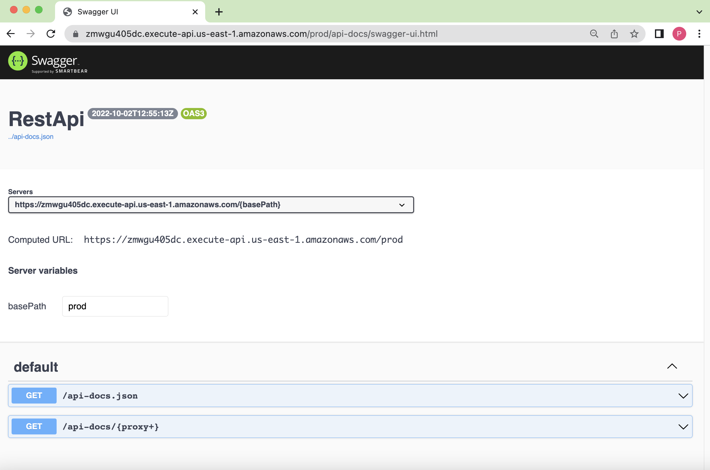

[](https://makeapullrequest.com)
[](https://github.com/pepperize/cdk-apigateway-swagger-ui/blob/main/LICENSE)
[](https://www.npmjs.com/package/@pepperize/cdk-apigateway-swagger-ui)
[](https://pypi.org/project/pepperize.cdk-apigateway-swagger-ui/)
[](https://www.nuget.org/packages/Pepperize.CDK.ApigatewaySwaggerUi/)
[](https://s01.oss.sonatype.org/content/repositories/releases/com/pepperize/cdk-apigateway-swagger-ui/)
[](https://github.com/pepperize/cdk-apigateway-swagger-ui/actions/workflows/release.yml)
[](https://github.com/pepperize/cdk-apigateway-swagger-ui/releases)
[](https://gitpod.io/#https://github.com/pepperize/cdk-apigateway-swagger-ui)

# CDK Apigateway SwaggerUI

Add SwaggerUI to your AWS Apigateway RestApi



## Install

### TypeScript

```shell
npm install @pepperize/cdk-apigateway-swagger-ui
```

or

```shell
yarn add @pepperize/cdk-apigateway-swagger-ui
```

### Python

```shell
pip install pepperize.cdk-apigateway-swagger-ui
```

### C\# / .Net

```
dotnet add package Pepperize.CDK.ApigatewaySwaggerUi
```

### Java

```xml
<dependency>
  <groupId>com.pepperize</groupId>
  <artifactId>cdk-apigateway-swagger-ui</artifactId>
  <version>${cdkApigatewaySwaggerUi.version}</version>
</dependency>
```

## Usage

```typescript
import { Stack } from "aws-cdk-lib";
import * as apigateway from "aws-cdk-lib/aws-apigateway";
import { SwaggerUi } from "@pepperize/cdk-apigateway-swagger-ui";

const stack = new Stack();
const restApi = new apigateway.RestApi();

new SwaggerUi(stack, "SwaggerUI", { resource: restApi.root });
```

- Open your SwaggerUI: `https://<rest api id>.execute-api.<aws region>.amazonaws.com/<stage>/api-docs/swagger-ui.html`
- View your API docs: `https://<rest api id>.execute-api.<aws region>.amazonaws.com/<stage>/api-docs.json`
